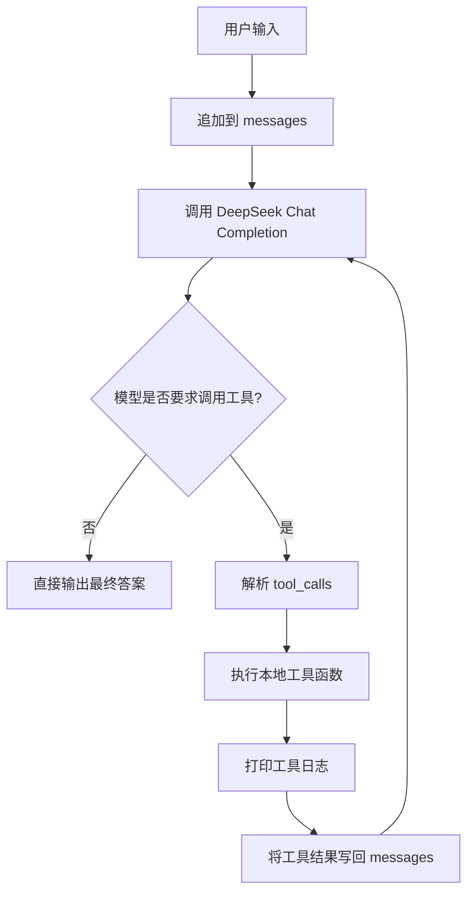

# DeepSeek Minimal Agent Project

一个可放到 GitHub 的最小单 Agent 项目，基于 **DeepSeek API + Python** 实现，支持：

- 普通问答
- 查询当前时间
- 查询天气（wttr.in）
- 读取本地 PDF 文件
- Tool Calling / Function Calling
- 多轮对话上下文维护
- 长文档 `map-reduce` 摘要
- 工具日志打印
- Streamlit Web Demo
- FastAPI 接口服务

---

## 1. 项目结构

```bash
deepseek_min_agent_project/
├── .env.example
├── requirements.txt
├── config.py
├── tools.py
├── agent.py
├── main.py
├── streamlit_app.py
├── api.py
└── README.md
```

---

## 2. 环境准备

### 2.1 创建虚拟环境
```bash
python -m venv .venv
source .venv/bin/activate   # Windows PowerShell 用 .venv\Scripts\Activate.ps1
```

### 2.2 安装依赖
```bash
pip install -r requirements.txt
```

### 2.3 配置环境变量
复制 `.env.example` 为 `.env`：

```bash
cp .env.example .env
```

填写你的 DeepSeek Key：

```env
DEEPSEEK_API_KEY=your_deepseek_api_key
DEEPSEEK_BASE_URL=https://api.deepseek.com
DEEPSEEK_MODEL=deepseek-chat
```

---

## 3. 运行方式

### 3.1 命令行版
```bash
python main.py
```

### 3.2 Streamlit Web Demo
```bash
streamlit run streamlit_app.py
```

### 3.3 FastAPI 服务
```bash
uvicorn api:app --reload --host 0.0.0.0 --port 8000
```

访问：
- 健康检查：`GET /health`
- 对话接口：`POST /chat`

示例：
```bash
curl -X POST "http://127.0.0.1:8000/chat" \
  -H "Content-Type: application/json" \
  -d '{"message": "现在几点？"}'
```

---

## 4. 支持的工具

### 4.1 `get_current_time`
获取本地时间

### 4.2 `get_weather(city)`
使用 wttr.in 获取天气  
示例输入：`帮我查一下北京天气`

### 4.3 `simple_calculator(expression)`
安全执行简单数学表达式  
示例输入：`帮我算一下 12*(3+4)`

### 4.4 `read_local_pdf(file_path, max_pages=50)`
读取本地 PDF 文本  
示例输入：`请读取 /home/xxx/test.pdf 并总结重点`

---

## 5. 上下文与 map-reduce

### 多轮对话
项目会维护 `messages` 历史，把：
- system prompt
- user 消息
- assistant 输出
- tool 输出

全部保存在上下文中，实现多轮对话。

### map-reduce
如果读取 PDF 后文本过长：
1. 先按长度切块
2. 对每个块摘要（map）
3. 再对所有摘要综合归纳（reduce）

这样可以避免直接把超长 PDF 原文整段塞给模型。

---

## 6. Agent 流程图



---

## 7. 后续增强方向

- 给工具参数加 `pydantic` 校验
- 增加本地知识库检索（RAG）
- 做 PDF 页面级 chunking
- 加工具权限控制
- 加消息持久化（SQLite / Redis）
- 用 LangGraph 重构为图结构 Agent
